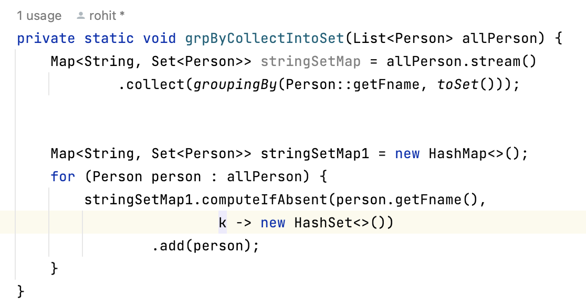
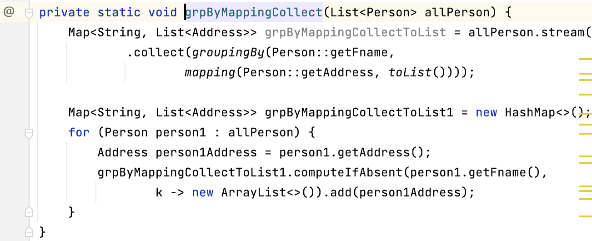
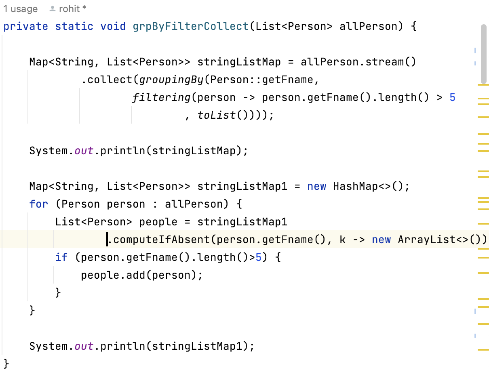
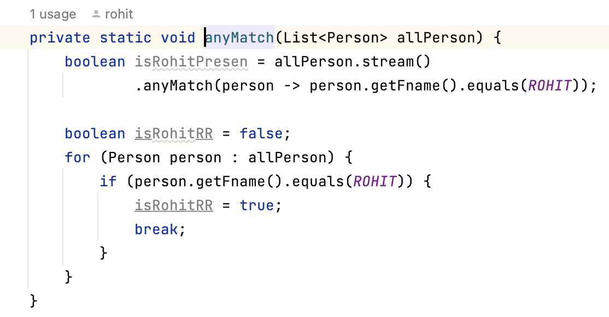
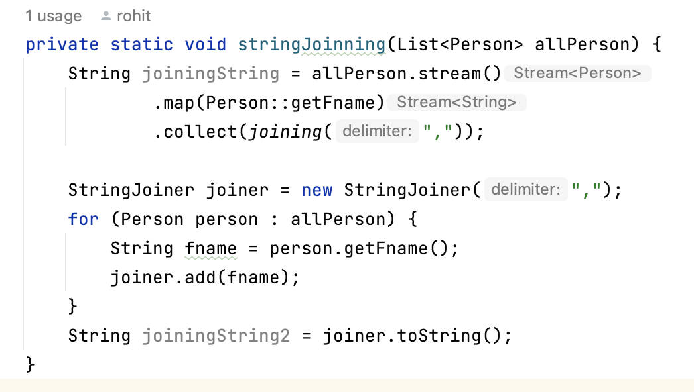

# Java 8 Transition: From Functional Style to Imperative Paradigm
 Welcome to the **Java 8 Transition: From Functional Style to Imperative Paradigm** repository! In this repository, we embark on a journey to explore the transition from functional programming style to the imperative paradigm in Java 8.
 
 Java 8 introduced significant changes to the language, most notably the inclusion of lambda expressions, functional interfaces, and streams. These features empowered developers to embrace functional programming principles and write concise, expressive, and highly modular code.
 
 However, while functional programming offers numerous benefits, there are scenarios where the imperative style might be more suitable or preferred. This repository focuses on understanding and converting functional-style code into imperative code where it aligns better with the problem domain or improves readability and maintainability.
 
 By examining real-world examples and common functional programming patterns, we will explore how to transform code snippets to follow an imperative approach while leveraging the power of Java 8 features. We will discuss scenarios where mutable state, control flow, and explicit iteration are more suitable alternatives to functional constructs.
<!-- TOC -->
* [Learn Java 8 By Converting Functional Style Code Into Imperative](#learn-java-8-by-converting-functional-style-code-into-imperative)
  * [Before Start](#before-start)
  * [Quick Look](#quick-look)
      * [**Filter** is Logically Equal to  **If Condition**](#filter-is-logically-equal-to-if-condition)
      * [**The Map** is Logically Equal to **get + add to the resultant Collection**](#the-map-is-logically-equal-to-get--add-to-the-resultant-collection)
      * [Some observations while working with **Collectors.groupingBy()**](#some-observations-while-working-with-collectorsgroupingby)
      * [Some observations while working with **Collectors.toMap(Function , Function )**](#some-observations-while-working-with-collectorstomapfunction--function-)
      * [**Sort Collection**](#sort-collection)
      * [**Any Match**](#any-match)
      * [**Find First with default Value**](#find-first-with-default-value)
      * [**Collectors.joining(delimiter)**](#collectorsjoiningdelimiter)
      * [**Count**](#count)
      * [**takeWhile**](#takewhile)
  * [Notes / Observation](#notes--observation)
<!-- TOC -->

## Before Start

* [Learn Java 8-Stream](https://github.com/rohitchavan-git/Learn-Java-8-Stream)
* [ Java 8 Workshop ](https://github.com/rohitchavan-git/java8-workshop)
* [Real Time Use Cases java 11 ](https://github.com/rohitchavan-git/Real-Time-Use-of-java-11-Stream-API)
* [Optional In Use](https://github.com/rohitchavan-git/OptionalInJava)

## Quick Look
#### **Filter** is Logically Equal to  **If Condition**

#### **The Map** is Logically Equal to **get + add to the resultant Collection**

#### Some observations while working with **Collectors.groupingBy()**

   1. Collectors.GroupingBy(Function<T,U> function) we can achieve this using **Map's** **computeIfAbsent()** method
   
   2. **Collectors.GroupingBy(Function<T,U> function,Collectors collector)**
   
   3. **Collectors.GroupingBy(,Collectors.counting())**
   
   4. **Collectors.GroupingBy(,mapping(function,Collector))**
   
   5. **Collectors.GroupingBy(Function<T,U>,filtering(Function ,Collector ))**
   
   6. **GroupingBy with Collect as a Map ( Map of String of Map )**
   
#### Some observations while working with **Collectors.toMap(Function , Function )**

1. **toMap(Function key , Function value)**
   
     it doesn't support null keys or values if you provide a null key or null value, it will though null-pointer
     exceptions
     

2. **toMap() with duplicate Key protection** using **3rd parameter**
   
#### **Sort Collection** 
   
#### **Any Match**
   
#### **Find First with default Value**
   
#### **Collectors.joining(delimiter)**
   
#### **Count** 
   
####  **takeWhile**
   

## Summary   

1. `filter`: The `filter` method in Java 8 streams allows you to apply a condition or predicate to elements in a
   collection and retain only those elements that satisfy the condition. It is similar to an `if` condition that filters
   elements based on a specific criterion.

2. `map`: The `map` method in Java 8 streams transforms each element in a collection by applying a given function to it.
   It is similar to using `get` to retrieve a value and then adding or putting the resultant transformed value into a
   collection.

3. `groupBy` collector using `map.computeIfAbsent()`: By using the `computeIfAbsent` method of the `Map` interface in
   Java 8, you can implement a grouping operation where elements are grouped by a certain key. If the key is not present
   in the map, a value can be computed using the provided mapping function (`Function<T, U>`). This allows you to create
   groups in the form of a map with keys and associated values.

4. `merge` method for implementing `groupBy` and `counting`: The `merge` method in Java 8 allows you to merge values
   into a map using a specified key and an operation. It is commonly used for grouping and counting elements in a
   collection. For example, you can merge values into a map where the key is a person's name, the initial value is 1,
   and the operation is to sum the values if a duplicate key is encountered.

5. Modifications in Java 8 `Map` collection: In Java 8, the `toMap` method in the `Collectors` class is used to create a
   map from a stream. However, it has certain restrictions such as not allowing duplicate keys or values, as well as
   disallowing null keys and values. To handle duplicate keys, you can provide a key conflict resolution strategy using
   the third parameter of `Collectors.toMap`. This allows you to specify how to handle conflicts when two keys are the
   same.

## Notes / Observation

* [Java 8 I2F Notes ](https://notesdocs.app/share/cbA5UGGquaySPD4bSjSWy5yUqfHZAlO3llCW-Java-8-I2F-)
* [Why functional Style Important](https://notesdocs.app/share/56qbTdjmbkjcTwHCEvEWVlHTUlMTuLhgVyOL-Why-functional-Style-is-Important)
