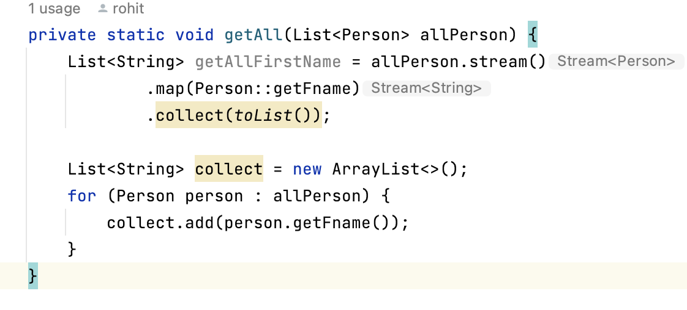
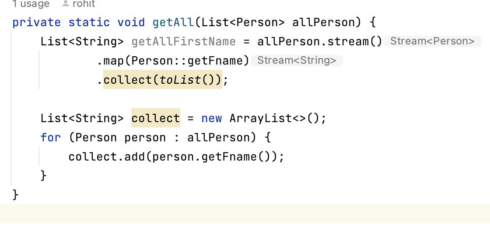
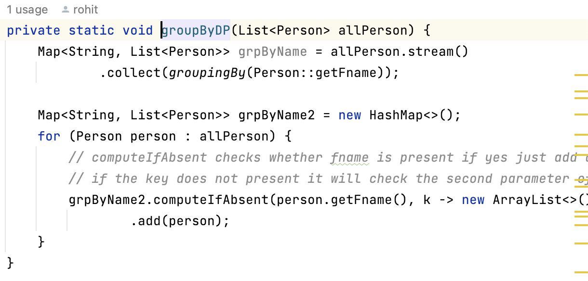
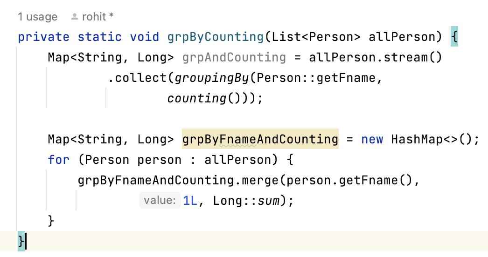
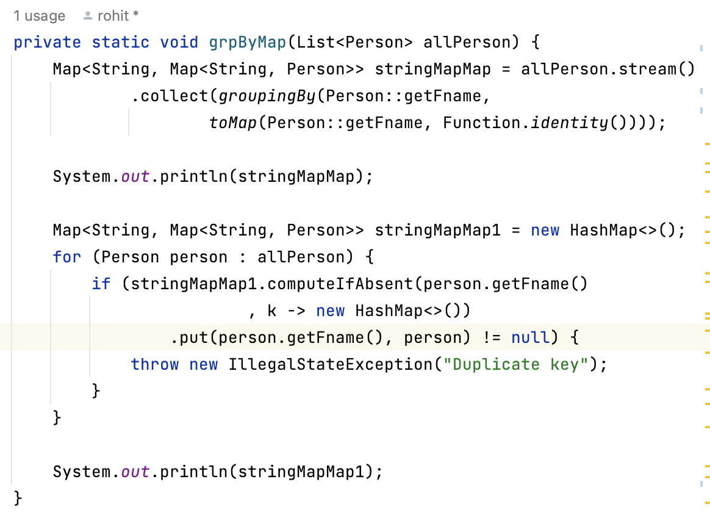
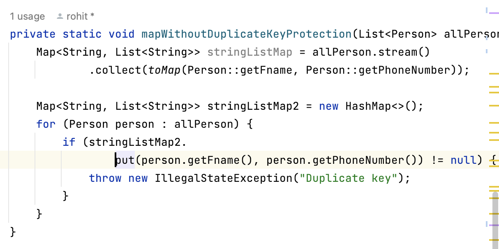
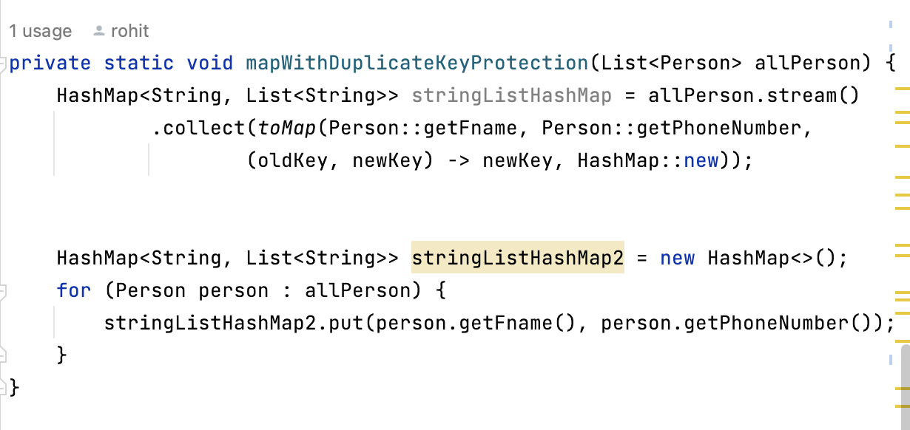
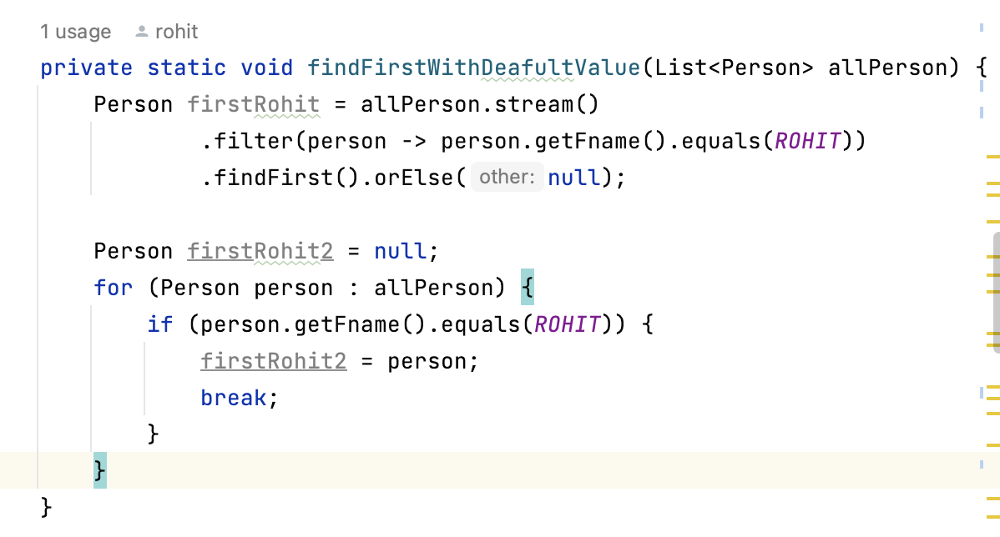
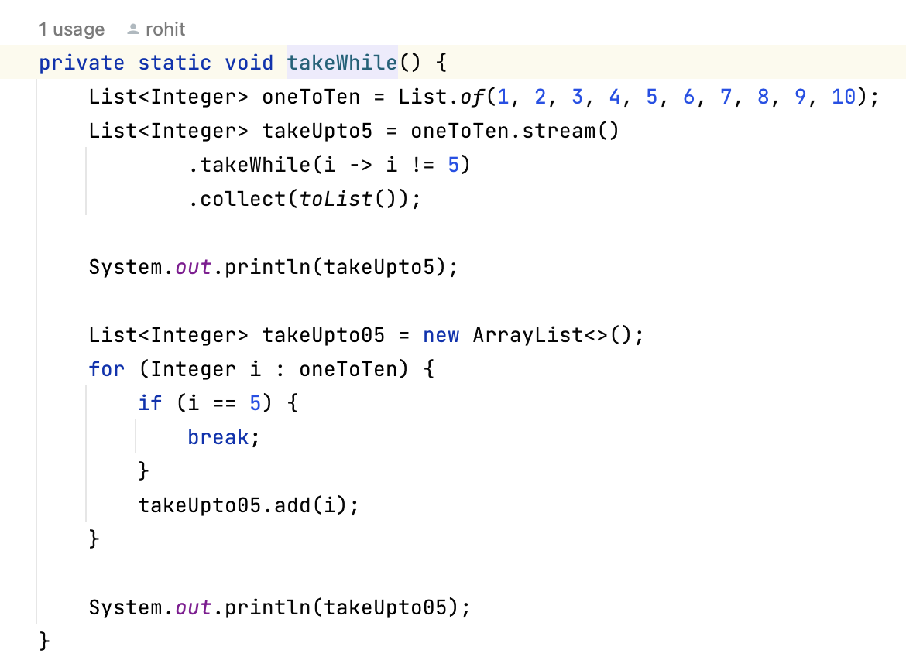

# Learn Java 8 By Converting Functional Style Code Into Imperative

<!-- TOC -->
* [Learn Java 8 By Converting Functional Style Code Into Imperative](#learn-java-8-by-converting-functional-style-code-into-imperative)
  * [Before Start](#before-start)
  * [Notes](#notes)
      * [**Filter** is Logically Equal to  **If Condition**](#filter-is-logically-equal-to-if-condition)
      * [**The Map** is Logically Equal to **get + add to the resultant Collection**](#the-map-is-logically-equal-to-get--add-to-the-resultant-collection)
      * [Some observations while working with **Collectors.groupingBy()**](#some-observations-while-working-with-collectorsgroupingby)
      * [Some observations while working with **Collectors.toMap(Function , Function )**](#some-observations-while-working-with-collectorstomapfunction--function-)
      * [**Sort Collection**](#sort-collection)
      * [**Any Match**](#any-match)
      * [**Find First with default Value**](#find-first-with-default-value)
      * [**Collectors.joining(delimiter)**](#collectorsjoiningdelimiter)
      * [**Count**](#count)
      * [**takeWhile**](#takewhile)
<!-- TOC -->

Java 8 has many new features and enhancements . In this repository we are going to learn Java 8 features but in diferent approach like 
1stly we should solve our problem using Functional style, and then we convert it into imperative to understand the other java 8 features. 

## Before Start

* [Learn Java 8-Stream](https://github.com/rohitchavan-git/Learn-Java-8-Stream)
* [ Java 8 Workshop ](https://github.com/rohitchavan-git/java8-workshop)
* [Real Time Use Cases java 11 ](https://github.com/rohitchavan-git/Real-Time-Use-of-java-11-Stream-API)
* [Optional In Use](https://github.com/rohitchavan-git/OptionalInJava)

## Notes
#### **Filter** is Logically Equal to  **If Condition**

#### **The Map** is Logically Equal to **get + add to the resultant Collection**

#### Some observations while working with **Collectors.groupingBy()**

   1. Collectors.GroupingBy(Function<T,U> function) we can achieve this using **Map's** **computeIfAbsent()** method
   
   2. **Collectors.GroupingBy(Function<T,U> function,Collectors collector)**
   
   3. **Collectors.GroupingBy(,Collectors.counting())**
   
   4. **Collectors.GroupingBy(,mapping(function,Collector))**
   
   5. **Collectors.GroupingBy(Function<T,U>,filtering(Function ,Collector ))**
   
   6. **GroupingBy with Collect as a Map ( Map of String of Map )**
   
#### Some observations while working with **Collectors.toMap(Function , Function )**

1. **toMap(Function key , Function value)**
   
     it doesn't support null keys or values if you provide a null key or null value, it will though null-pointer
     exceptions
     

2. **toMap() with duplicate Key protection** using **3rd parameter**
   
#### **Sort Collection** 
   
#### **Any Match**
   
#### **Find First with default Value**
   
#### **Collectors.joining(delimiter)**
   
#### **Count** 
   
####  **takeWhile**
   
   

